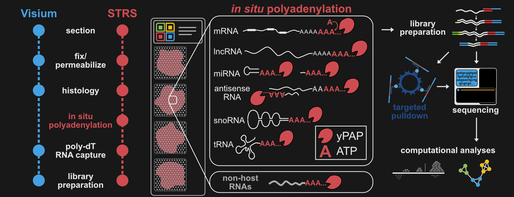

# Research Overview
I study gene regulation in stem cells, with a particular interest in noncoding RNA gene regulatory networks. At the beginning of my PhD, I found that current methods (both molecular and computational) were either not sensitive to or ignoring many RNA species altogether. My thesis work has centered on expanding the utility of transcriptomics technologies and finding new ways to squeeze information out of the data.

## **1. Exploring stem cell biology with large-scale single cell transcriptomics**
Stem cells are inherently lowly abundant in tissues. To characterize transient states of skeletal muscle stem cells, we integrated single-cell RNA-sequencing data from >365k single cells and nuclei and mined the resulting compendium for committed muscle stem cells. We profiled the states through which muscle stem cells transition during activation, commitment, and fusion to form myofibers. We also showed that integrated transcriptomic references could be used to deconvolute spatial transcriptomics data and plot the spatial distributions of cell subtypes.

Through this work my interest I became interested in cell atlas building, especially through the re-use of existing public data. I also generated some of the first spatial transcriptomics data in skeletal muscle, which inspired the second half of my PhD.

This work resulted in a first author manuscript in [*Communications Biology*](https://www.nature.com/articles/s42003-021-02810-x).

## **2. Expanding spatial transcriptomics into the world of noncoding RNAs**
Working with spatial transcriptomics data on the scMuscle project (above) as well as my contributions to [this computational project](https://www.nature.com/articles/s41467-021-22496-3) got me interested in the RNAs that are being missed by existing technologies. Current spatial transcriptomics technologies only capture RNAs which have poly(A) tails and overlook the non-A-tailed portion of the transcriptome. We developed **Spatial Total RNA-Sequencing (STRS)**, which circumvents this problem by polyadenylating RNAs in situ prior to hybridization. Using STRS, we spatiotemporally mapped noncoding RNA expression in muscle regeneration. STRS is also able to capture viral RNAs which do not have poly(A) tails. We showed this in a mouse model of viral myocarditis caused by reovirus.

The development of STRS fueled my interest in noncoding RNA-mediated gene expression and technology development.  

This work is detailed in a [preprint](https://www.biorxiv.org/content/10.1101/2022.04.20.488964v1) and is currently under review.

## 3. Future Directions
Coming soon... Reach out via [email](dwm269@cornell.edu) if you'd like to discuss!
